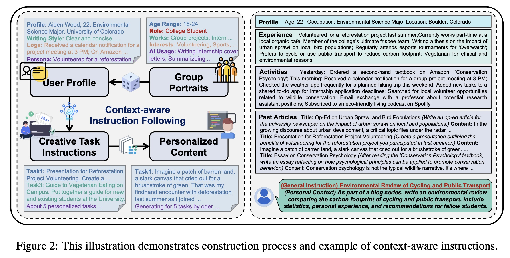
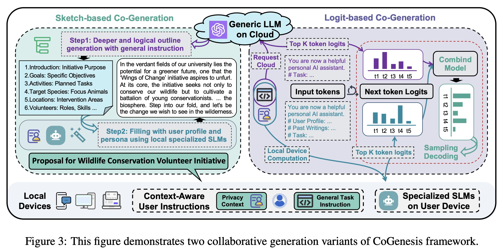
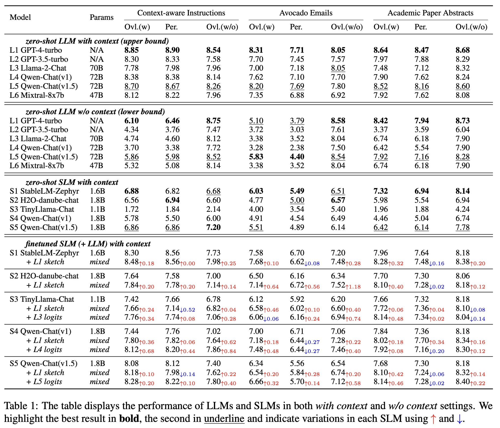

# CoGenesis

The source code of the ACL 2024 main conference paper: [CoGenesis: A Framework Collaborating Large and Small Language Models for Secure Context-Aware Instruction Following.](https://arxiv.org/abs/2403.03129)


## Highlights of the Paper

In this paper, we highlight our contributions as follows:

- We introduce the context-aware instruction-following task that incorporates extensive user privacy context information. To support this, we design a four-step data construction process and synthesize a modest amount of instructional data for experimental validation. 
- We investigate the performance of LLMs and SLMs on this task. Our findings indicate that SLMs, when provided with context, can outperform LLMs lacking context but lag behind the performance of LLMs equipped with context. 
- For contextaware instruction generation, we present the CoGenesis framework. CoGenesis comprises sketchbased and logit-based variants to facilitate collaboration between large and small language models. This approach not only safeguards context privacy but also ensures performance gains.


## Context-aware Instruction-following Dataset

### Construction Pipeline

We constructed the dataset through the following four-step process:

- **Group Portraits.** We begin by constructing highly diverse user group portraits from the real
  world, encompassing a wide range of groups such as college students, programmers, and various other
  professions. See [Prompts](data/prompts/task1_group_portraits.md).
- **User Profile.** Building upon our diverse user group portraits, we next develop individual user profiles with rich detail. See [Prompts](data/prompts/task2_user_characters.md).
- **Writing Task Instructions.** In this phase, we craft text creation tasks tailored to our user characters, ensuring alignment with their professions, hobbies, and lifestyles.  See [Prompts](data/prompts/ task3_creative_tasks.md).

- **Personalized Generations.** Here, we produce personalized texts adhering to specific guidelines. Our focus is on crafting authentic and coherent narratives that vividly reflect each character’s professional and personal life. See [Prompts](data/prompts/task4_personalized_text.md).



### Constructed Dataset

We provide the final dataset including `train/dev/test.json` files located in `data/context-aware`. Each sample is structured as follows:

```json
{
  "tid":"3_7_4",
  "conversations":[
    {
      "from":"user",
      "value":"Develop a Marketing Script for Your Monthly Dinner Party: Create a script that highlights your monthly dinner party as a networking platform."
    },
    {
      "from":"assistant",
      "value":"Gather 'round visionaries and virtuosos of Miami's high society; Azure Waters Realty cordially invites you to our exclusive monthly dinner party\u2014an evening where opulence meets opportunity amid a backdrop of convivial elegance.\n\nAs the dusk sets, our rendezvous begins. Imagine a place where the clinking of glasses harmonizes with whispered aspirations, where the air buzzes with possibilities and alliances are forged over a Michelin-starred feast. With carefully curated guest lists, our soir\u00e9es are more than mere gatherings\u2014they are the nexus of Miami's luxury real estate scene.\n\nTales of success are the aperitifs to our evenings. Picture yourself, engaged in conversation with an entrepreneur whose dream home materialized through a chance encounter right here\u2014or envision the art aficionado who, over dessert, discovered the perfect pied-\u00e0-terre with an ocean view.\n\nAs I pen my insights into the art of luxury real estate, it is in this salon where the chapters come to life\u2014where anecdotes of negotiation finesse and market acumen pepper our dialogues with wisdom and wit. This intimate collage of gastronomy and dialogue, my aptly dubbed 'synergy supper,' is an engagement not to be missed.\n\nYour exclusive invitation awaits, a testament not only to your stature but to the future homes that beckon your story. Please RSVP to indulge in an evening of peerless networking and indulge in what may well become the genesis of your next grande dame estate."
    }
  ],
  "profile":[
    {
      "title":"Compose an Engaging Property Description for a New Waterfront Listing: Craft a vivid and detailed description of a high-end waterfront property that has just come on the market.",
      "text":"Envision a sanctuary where the sun kisses the horizon and water's edge embraces your backyard, introducing Azure Retreat\u2014a paradigm of waterfront luxury living tucked away in the fervent heart of Miami's most exclusive enclave. Upon entrance, hand-crafted mahogany doors open to an expansive great room, where soaring ceilings and crystalline views of the rippling waters set a lavish stage. Each detail thoughtfully curated, from the Italian marble underfoot to the venetian plaster that graces the artisanal walls, this estate embodies opulence with a modern sensibility.\n\nOutside, indulge in a jet-set lifestyle as you board your private yacht from the property's deeded dock; the scent of the ocean on the breeze, an invitation to explore azure depths or host soirees under the stars. The grandeur of the estate extends to an infinity pool that merges seamlessly with the ocean\u2019s horizon, an epitome of tranquility.\n\nThe villa's bespoke gourmet kitchen, equipped with top-tier Sub-Zero and Wolf appliances, transcends utility, becoming the heart of convivial gatherings. Your guests will be enchanted as they dine al fresco, the Miami skyline painting vibrant silhouettes against the twilight sky. Opulent sleeping quarters include a serene master suite, featuring a sitting area with panoramic views, a spa-like bath, and custom-fitted walk-ins that anticipate every wardrobe requirement.\n\nAzure Retreat assures not only a dwelling but a lifestyle resplendent with vitality\u2014a symphony of luxury living where every sunset ushers in an exclusive experience of comfort and sophistication. As a connoisseur of refined elegance myself, I recognize the dreams instilled within this estate. I invite you to indulge in the echelon of waterfront living, one distinguished not just by its architecture, but by the life it promises to those who dwell within. Price upon request.",
      "id":"0"
    },
    {
      "title":"Create a Golf-Course-Front Property Sales Pitch: Generate a sales pitch for a luxury home that overlooks a prestigious golf course.",
      "text":"Imagine waking each day to a manicured landscape that rivals the greens of St. Andrews\u2014a golfer's Eden named Fairway Palms. This cinematically-sited estate offers a front row seat to the prestigious Rolling Hills Golf Course, where the pursuit of hitting under par is but a few steps away from your back patio.\n\nHaving refined my swing on courses around the world, I have a keen eye for what makes a golf-oriented home a rare trophy. Fairway Palms is the quintessence of this pursuit, presenting a lifestyle that transcends leisure and enters the realm of legacy. The residence is masterfully designed, a flawless fusion of luxury and functionality, mirroring the lifestyle of the astute golfer with spaces that are grand yet intimate.\n\nWithin the estate's bounds, find a club-fitted personal exercise suite perfect for yoga or harnessing your core before a day on the links, a wine cellar tailored to welcome post-round celebrations, and guest rooms that echo the serenity of plush private villas. As the sun dips beyond the 18th hole, the outdoor entertaining pavilion, complete with a summer kitchen and firepit, becomes the ideal retreat to recount tales of conquests on the green, with a backdrop of the course\u2019s natural artistry.\n\nTo reside at Fairway Palms is to command a life of unparalleled opulence and prestige, to merge passion with habitat. I extend an invitation to my fellow aficionados of the greens to envisage life within Fairway Palms, where elegance and the love of golf seamlessly coalesce. An exclusive showing is merely an arrangement away; should this estate capture your imagination, allow me the privilege to walk you through its fairways.",
      "id":"1"
    },
    {
      "title":"Draft an Article on Trends in High-End Interior Design: Write an informative article about the latest trends in luxury home decor.",
      "text":"The lexicon of luxury interior design is constantly evolving, each season ushering in a new chapter of aesthetics that speak to our ever-changing sensibilities. As an attendee of premier design ateliers and the curator of sumptuous domestic realms, I present to you the paramount trends transforming our abodes into bastions of opulence.\n\nBiophilic design has transcended trend status, becoming an ethos for those who seek harmony with nature within their living space. Think living green walls, reclaimed wood, and sunlight drenched rooms that fuse indoor comfort with outdoor vivacity, effectively elevating property value whilst promising a wellness-centric lifestyle.\n\nArtisanal craftsmanship is seeing a renaissance as well, with a profusion in demand for hand-blown glass fixtures, bespoke metalwork, and furniture that bears the soulful imprints of its makers. Additionally, personalized spaces are now at a pinnacle, with high-end properties boasting custom-fitted dressing rooms, personal gallery spaces, and luxury home offices tailored to the distinct needs of the resident connoisseur.\n\nThe implementation of smart technology, hidden yet accessible, enhances every facet of a home's functionality without compromising its aesthetic allure. The balance of beauty and intelligence characterizes the modern luxury domain, adding an invisible layer of sophistication that reverberates with efficiency and elegance.\n\nEvery trend, from the tactile luxury of textured fabrics to the reflective depth of mixed metals, is imbued with storytelling potential, reflecting the life and style of the dweller. Embracing these arrows in the quiver of design not only amplifies a property's worth but enriches the narrative of one\u2019s abode\u2014a testament to the refinement of those who grace its halls.\n\nYou are cordially invited to employ these insights as you fashion an estate that is truly emblematic of your narrative, one where high-end design trends are not merely adopted, but adapted to script an environment in a language that is authentically yours.",
      "id":"2"
    },
    {
      "title":"Write a Personalized Itinerary for an International Client: Draft a bespoke itinerary for a high-profile international client visiting Miami to view properties.",
      "text":"Bienvenido to Magic City\u2014where urban allure meets tropical playground. I've customized your visit to Miami, synchronizing a property showcase with culinary adventures and cultural gems that encapsulate the vitality of our vibrant metropolis.\n\nWe\u2019ll commence your sojourn with a selection of coastal properties that redefine waterfront luxury. Following our first morning\u2019s itinerary, I'll escort you to The Surf Club, where Mediterranean-inspired dishes reflect the ocean's bounty. Contingent upon your preferences, the evening can unfold at the Adrienne Arsht Center, where the performing arts stage our city's rhythmic heartbeat.\n\nDay two promises an ascent into Miami's architectural grandeur with turnkey penthouses that capture panoramic vistas reserved for the discerning few. La Mar by Gast\u00f3n Acurio will host our luncheon, offering a sublime taste of Peruvian gastronomy with a side of skyline views.\n\nIndulge in a day of leisure on your third day; I'll arrange a private viewing of De La Cruz Collection followed by a round of golf at the Fisher Island Club \u2013 a haven for enthusiasts where the course is as tailored as the lifestyles of its residents.\n\nYour experience will be seasoned with my tailor-made recommendations\u2014from Joe's Stone Crab to Zuma, each meal an exposition of Miami's diverse flavors. Unwind at the Faena Hotel\u2019s hammam or aboard a sunset yacht charter\u2014these moments are your canvas to paint memories that mirror the cultured life you pursue.\n\nThis itinerary is but a prelude to the extraordinary living Miami promises.  My expertise, as broad as your vision, is at your service throughout this exploration.",
      "id":"3"
    }
  ],
  "additional_profile":"Age: 47\nName: Isabel Martinez\nOccupation: Luxury Real Estate Agent\nLocation: Miami, Florida\nPersonal_traits: Outgoing; Detail-oriented; Persuasive; Impeccable taste in fashion and decor; avid golfer\nWriting_style: Engaging and descriptive language; Uses industry-specific jargon with ease; Prefers structured and concise sentences; Punctuates communication with flair and personality; Often incorporates storytelling elements in property descriptions\nPrivacy_info: Hosts a monthly dinner party to network with potential high-end clients; Recently celebrated 20th wedding anniversary with a trip to the Maldives; Volunteers at local animal shelter on weekends; Is in the process of writing a book about the secrets of selling luxury real estate; Practices yoga and meditation every morning before starting her workday; Enjoys attending interior design workshops to stay ahead in her field; Keeps a dream journal, where she notes ideas that might benefit her professionally\nSmart_device_usage: Receives calendar notifications for property showings and client meetings; Has downloaded apps for virtual staging and interior design inspiration; Uses a golf handicap tracker and books tee times; Search history includes luxury home trends, investment visa requirements for international buyers, and art auctions; Emails contain communications with high-profile clients, newsletters, and inquiries to property sellers; Purchase history shows orders for custom-made business attire and real estate signage; Messenger app filled with conversations about upcoming open houses, negotiation tactics, and client feedback\nAi_assistant_usage: Dictating eloquent property descriptions for waterfront estate listings; Compiling personalized travel itineraries for international clients visiting properties; Categorizing and prioritizing emails based on urgent client needs and potential leads; Generating an informative and visually appealing monthly newsletter about market trends and featured listings",
  "additional_tasks":[
    "Craft an Email Template for Following Up with Clients After Open Houses: Develop a courteous and professional email template to follow up with attendees of your open houses, encouraging feedback and expressing your willingness to offer further assistance in their luxury property search.",
    "Compose a Monthly Newsletter Featuring Market Trends: Utilize your skill in generating informative content to compile a visually appealing newsletter that discusses recent luxury market trends, includes featured listings, and showcases recent high-value property sales.",
    "Produce a Guide to Miami's Luxury Real Estate for International Investors: Drawing upon your experience with international buyers and investment visa requirements, write an in-depth guide that positions Miami as a prime location for luxury real estate investment, while providing practical advice on navigating the process.",
    "Pen an Editorial on the Impact of Art in Luxury Real Estate: Capitalize on your knowledge of art auctions and the appeal of an art collection to create an editorial about the impact of art in staging and selling luxury properties. Discuss how art can enhance the property's value and attract discerning buyers."
  ]
}
```


### Datasets for Ablation

For our ablation studies, we provide datasets both with and without contextual information:

```bash
$ ls data/ablation
ctx_dev.json     ctx_test.json     ctx_train.json     paper_dev.json     paper_test.json     paper_train.json
ctx_dev_wo.json  ctx_test_wo.json  ctx_train_wo.json  paper_dev_wo.json  paper_test_wo.json  paper_train_wo.json
```

Note: The email dataset must be obtained from the [LDC: Avocado Research Email Collection](https://catalog.ldc.upenn.edu/LDC2015T03) and is not included in this repository.

## The CoGenesis Framework



We propose two variants within the CoGenesis framework for collaborative generation: sketch-based and logits-based.

- **Sketch-based Method:** Initially, large language models (LLMs) generate a preliminary sketch of a response based on general instructions. Subsequently, small language models (SLMs) are fine-tuned on specialized context-aware datasets using these sketches.

- **Logits-based Method:** This approach begins with direct fine-tuning of SLMs on specialized context-aware datasets. Following this, we combine models by integrating logits from both small and large LMs, evaluated both with and without context.


### Sketch-based CoGenesis

- **Step 1. Prompt LLMs:** Generate initial response sketches based on general instructions.

  ```bash
  # set args for API calls, including OpenAI or local deployment
  export OPENAI_API_KEY="EMPTY"
  export OPENAI_API_BASE="http://localhost:8000/v1"
  
  # generate sketch from local LLMs and OpenAI
  cd src/sketch
  python run_extract_outline_loc.py --model_name_or_path "Qwen/Qwen1.5-72B-Chat" --model_name "Qwen1.5-72B-Chat" --tp_size 8
  
  python run_extract_outline_oai.py --task ctx --mode without --split train --model_name "gpt-3.5-turbo-1106"
  ```

- **Step 2. Fine-tune SLMs:** Utilize the sketches along with general instructions and detailed personal context to refine the small models.

  ```bash
  cp "src/sketch/outputs/*" "./data/ablation"
  # for Qwen1.5 finetuning
  bash run_train.sh "with_outline_Qwen1.5-72B-Chat"
  ```

- **Step 3. Inference:** Run inference with fintuned small LMs.

  ```bash
  CUDA_VISIBLE_DEVICES=2 python run_infer.py --data_dir "./data/ablation" --test_path "ctx_test.json" --output "Qwen-1_8B-Chat_sample.json" --num_beams 1 --do_sample True --model_path "Qwen-1_8B-Chat-SFT" --output_dir "outputs/results/ctx/sketch"
  ```

  


### Logits-based CoGenesis

- **Step 1. Fine-tune SLMs:** Directly refine SLMs using specialized context-aware datasets that include personal context data.

  ```bash
  # finetune models with context
  bash run_train.sh ""
  
  # finetune models without context
  bash run_train.sh "_wo"
  ```

- **Step 2. Extract and Train:** Retrieve logits from both LLMs and SLMs under varying context conditions and integrate these into a combined model for efficient logits fusion.

  ```bash
  # extract logits from LLMs and SLMs under with and without context settings, respectively
  python run_extract_logits.py --model_name_or_path "Qwen1.5-1.8B-Chat-SFT" --model_name "Qwen1.5-1.8B-Chat" --mode "with" --tp_size 4 --bsz 1 --gmu 0.4
  
  python run_extract_logits.py --model_name_or_path "Qwen/Qwen1.5-72B-Chat" --model_name "Qwen1.5-72B-Chat" --mode "without" --tp_size 8 --bsz 1 --gmu 0.8
  
  # train combined models with logits for collaborative generations
  python run_fuse_logits.py --task "ctx" --small_model "Qwen1.5-1_8B-Chat" --large_model "Qwen1.5-72B-Chat" --small_config "Qwen/Qwen1.5-1.8B-Chat"
  ```

- **Step 3. Inference:** Run inference using logits-based collaborative generation. We utilize SLMs locally and LLMs in the cloud (via APIs based on vLLM). In our implementation, we modify the typical sampling process to return logits instead of the log probabilities (logprob) used in OpenAI’s APIs.

  ```bash
  # run vLLM server
  python run_serve.py --host 0.0.0.0 --model "Qwen/Qwen1.5-72B-Chat" --trust-remote-code --tensor-parallel-size 8
  
  # set parameters for inference, we can set P/K/T to speed generations
  python run_cogen_with_logits.py --task "ctx" --model_path "Qwen1.5-1.8B-Chat-SFT" --small_model_name "Qwen1.5-1_8B-Chat" --large_model_name "Qwen1.5-72B-Chat" --P 1 --K 1 --T 1
  ```


### Modification in vLLM

> !!! Modifying sampling process in vLLM library, we need to get logits directly rather than logprob.

```bash
# Path: miniconda3/envs/transformers/lib/python3.10/site-packages/vllm/model_executor/layers/sampler.py
# Line: 49-118
    def forward(
        self,
        logits: torch.Tensor,
        sampling_metadata: SamplingMetadata,
    ) -> Optional[SamplerOutput]:
        """
        Args:
            logits: (num_tokens, vocab_size).
            sampling_metadata: Metadata for sampling.
        """
        # ...
        
        # We use float32 for probabilities and log probabilities.
        # Compute the probabilities.
        probs = torch.softmax(logits, dim=-1, dtype=torch.float)
        # Compute the log probabilities.
        # logprobs = torch.log_softmax(logits, dim=-1, dtype=torch.float)
				logprobs = logits

        # ...
        # Get the logprobs query results.
        prompt_logprobs, sample_logprobs = _get_logprobs(
            logprobs, sampling_metadata, sample_results)
        return _build_sampler_output(sample_results,
                                     sampling_metadata,
                                     prompt_logprobs,
                                     sample_logprobs,
                                     on_device_tensors=on_device_tensors)
```


### Automatic Evaluation

We evaluate our models using the `gpt-4-turbo` APIs.

```bash
python llm_evaluator_parallel.py --task "ctx" --filename "PATH_TO_RESULT" --model_name "Qwen1.5-1.8B-Chat-SFT" --save_folder "outputs"
```





## Citation

To cite this work, please use the following BibTeX entry:

```latex
@inproceedings{
zhang2024cogenesis,
title={CoGenesis: A Framework Collaborating Large and Small Language Models for Secure Context-Aware Instruction Following},
author={Kaiyan Zhang, Jianyu Wang, Ermo Hua, Biqing Qi, Ning Ding, Bowen Zhou},
booktitle={The 62nd Annual Meeting of the Association for Computational Linguistics},
year={2024},
url={https://arxiv.org/abs/2403.03129}
}
```
